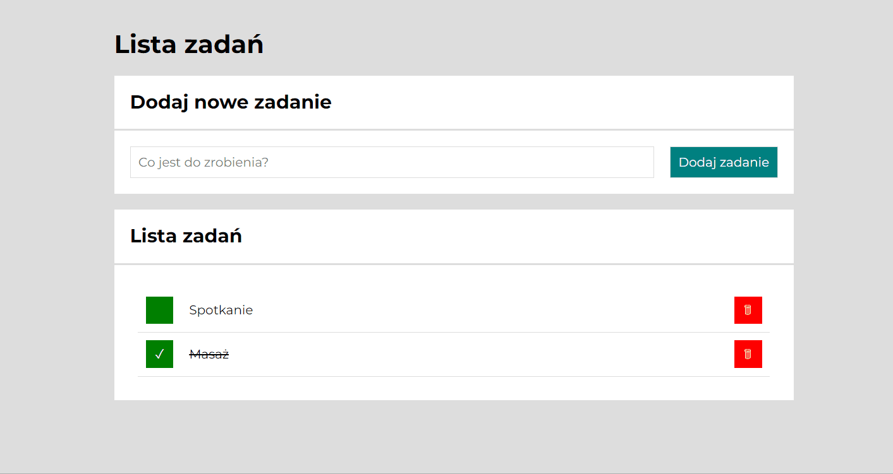

# Tasks list

## Demo

https://ulyanalakevich.github.io/Tasks-list/
## Description
This website is a tasks list. You can write there what you have to do and when you are done, delete this task or mark it is done. This website will help you for making to do lists but also for making for example shopping lists.

## Intructions
First you need to write task, and tap at the button or tap enter. Then you will see this task in your list. If you already have done your task, you can tap at the green square by left side to mark it with a tick and cross it out. If you want to  delete this task, you need to tap at the red square button by right side.

## Used technologies

HTML, CSS, JS, BEM convention.

